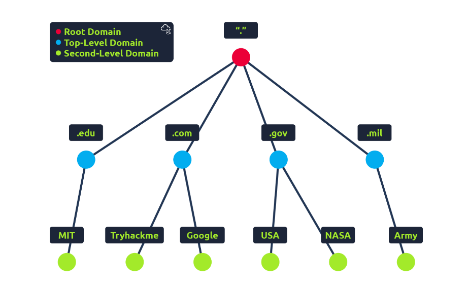
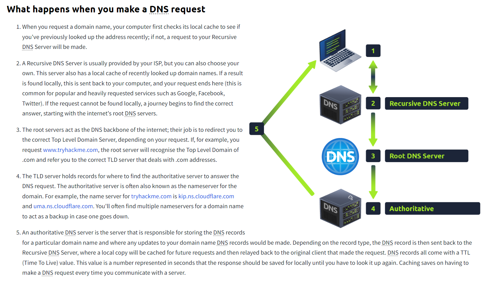

**Task 1**

**What is DNS?**
DNS (Domain Name System) provides a simple way for us to communicate with devices on the internet without remembering complex numbers. Much like every house has a unique address for sending mail directly to it, every computer on the internet has its own unique address to communicate with it called an IP address. An IP address looks like the following 104.26.10.229, 4 sets of digits ranging from 0 - 255 separated by a period. When you want to visit a website, it's not exactly convenient to remember this complicated set of numbers, and that's where DNS can help. So instead of remembering 104.26.10.229, you can remember tryhackme.com instead.

Answers:
What does DNS stand for?
```
Domain Name System
```

**Task 2**



**TLD (Top-Level Domain)**

A TLD is the most righthand part of a domain name. So, for example, the tryhackme.com TLD is **.com**. There are two types of TLD, gTLD (Generic Top Level) and ccTLD (Country Code Top Level Domain). Historically a gTLD was meant to tell the user the domain name's purpose; for example, a .com would be for commercial purposes, .org for an organisation, .edu for education and .gov for government. 

**Second-Level Domain**

Taking tryhackme.com as an example, the .com part is the TLD, and tryhackme is the Second Level Domain. When registering a domain name, the second-level domain is limited to 63 characters + the TLD and can only use a-z 0-9 and hyphens (cannot start or end with hyphens or have consecutive hyphens).

**Subdomain**  

A subdomain sits on the left-hand side of the Second-Level Domain using a period to separate it; for example, in the name admin.tryhackme.com the admin part is the subdomain. A subdomain name has the same creation restrictions as a Second-Level Domain, being limited to 63 characters and can only use a-z 0-9 and hyphens (cannot start or end with hyphens or have consecutive hyphens). You can use multiple subdomains split with periods to create longer names, such as jupiter.servers.tryhackme.com. But the length must be kept to 253 characters or less. There is no limit to the number of subdomains you can create for your domain name.

What is the maximum length of a subdomain?

Which of the following characters cannot be used in a subdomain ( 3 b _ - )?
```
63
```
What is the maximum length of a domain name?
```
_
```
What type of TLD is .co.uk?
```
253
```
What type of TLD is .co.uk?
```
ccTLD
```

**Task 3**

**A Record**

These records resolve to IPv4 addresses, for example 104.26.10.229

**AAAA Record**

These records resolve to IPv6 addresses, for example 2606:4700:20::681a:be5  

**CNAME Record**

These records resolve to another domain name, for example, TryHackMe's online shop has the subdomain name store.tryhackme.com which returns a CNAME record shops.shopify.com. Another DNS request would then be made to shops.shopify.com to work out the IP address.  

**MX Record**

These records resolve to the address of the servers that handle the email for the domain you are querying, for example an MX record response for tryhackme.com would look something like alt1.aspmx.l.google.com. These records also come with a priority flag. This tells the client in which order to try the servers, this is perfect for if the main server goes down and email needs to be sent to a backup server.

**TXT Record**

TXT records are free text fields where any text-based data can be stored. TXT records have multiple uses, but some common ones can be to list servers that have the authority to send an email on behalf of the domain (this can help in the battle against spam and spoofed email). They can also be used to verify ownership of the domain name when signing up for third party services.

What type of record would be used to advise where to send email?
```
MX
```
What type of record handles IPv6 addresses?
```
AAAA
```

**Task 4**



Answers:

What field specifies how long a DNS record should be cached for?
```
TTL
```
What type of DNS Server is usually provided by your ISP?
```
recursive
```
What type of server holds all the records for a domain?
```
authoritative
```

**Task 5**

What is the CNAME of shop.website.thm?


Adjust the DNS Type to CNAME and put shop as the subdomain before sending the DNS Request

Answers:

```
shops.myshopify.com
```

What is the value of the TXT record of website.thm?

![[32.png]]

It's pretty much the same pattern but I would say it would be more useful if you typed the commands out yourself.

Answers:

```
THM{7012BBA60997F35A9516C2E16D2944FF}
```

![[33.png]]

What is the numerical priority value for the MX record?

![[34.png]]

Answers:

```
30
```

What is the IP address for the A record of www.website.thm?

![[35.png]]

Answers:

```
10.10.10.10
```