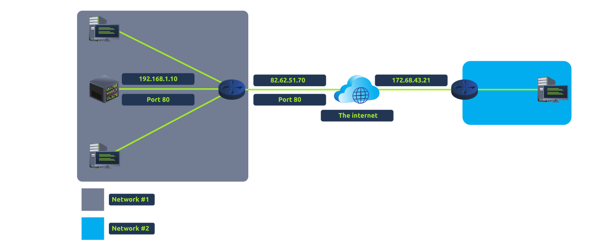

**Task 1**
Port forwarding is an essential component in connecting applications and services to the Internet. Without port forwarding, applications and services such as web servers are only available to devices within the same direct network.



Answers:

What is the name of the device that is used to configure port forwarding?
```
router
```

**Task 2**

A firewall is a device within a network responsible for determining what traffic is allowed to enter and exit. Think of a firewall as border security for a network. An administrator can configure a firewall to **permit** or **deny** traffic from entering or exiting a network based on numerous factors such as:

- Where the traffic is coming from? (has the firewall been told to accept/deny traffic from a specific network?)
- Where is the traffic going to? (has the firewall been told to accept/deny traffic destined for a specific network?)
- What port is the traffic for? (has the firewall been told to accept/deny traffic destined for port 80 only?)
- What protocol is the traffic using? (has the firewall been told to accept/deny traffic that is UDP, TCP or both?)

| **Firewall Category** | **Description**                                                                                                                                                                                                                                                                                                                                                                                                                                                                                                                                                                                                                                     |
| --------------------- | --------------------------------------------------------------------------------------------------------------------------------------------------------------------------------------------------------------------------------------------------------------------------------------------------------------------------------------------------------------------------------------------------------------------------------------------------------------------------------------------------------------------------------------------------------------------------------------------------------------------------------------------------- |
| Stateful              | This type of firewall uses the entire information from a connection; rather than inspecting an individual packet, this firewall determines the behaviour of a device **based upon the entire connection**.<br><br>This firewall type consumes many resources in comparison to stateless firewalls as the decision making is dynamic. For example, a firewall could allow the first parts of a TCP handshake that would later fail.<br><br>If a connection from a host is bad, it will block the entire device.                                                                                                                                      |
| Stateless             | This firewall type uses a static set of rules to determine whether or not **individual packets** are acceptable or not. For example, a device sending a bad packet will not necessarily mean that the entire device is then blocked.<br><br>Whilst these firewalls use much fewer resources than alternatives, they are much dumber. For example, these firewalls are only effective as the rules that are defined within them. If a rule is not exactly matched, it is effectively useless.<br><br>However, these firewalls are great when receiving large amounts of traffic from a set of hosts (such as a Distributed Denial-of-Service attack) |
Answers:

What layers of the OSI model do firewalls operate at?
```
router
```
What category of firewall inspects the **entire connection**?
```
router
```
What category of firewall inspects individual packets?
```
router
```
