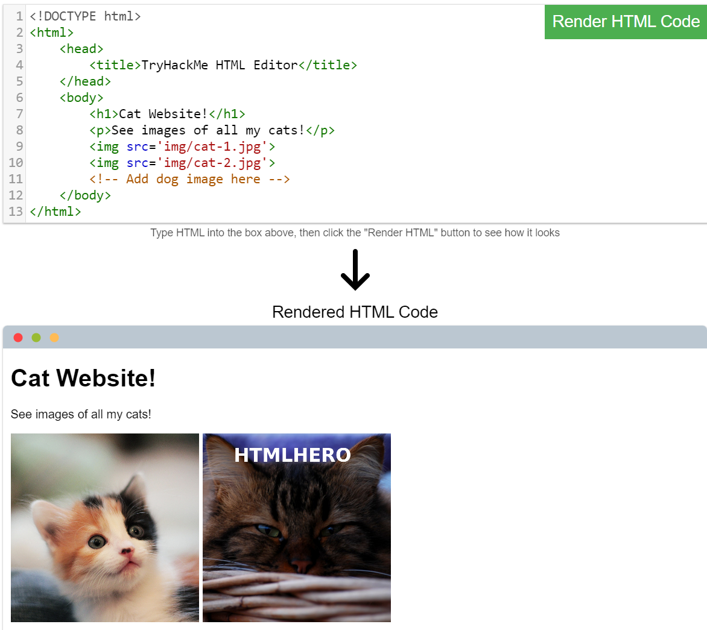
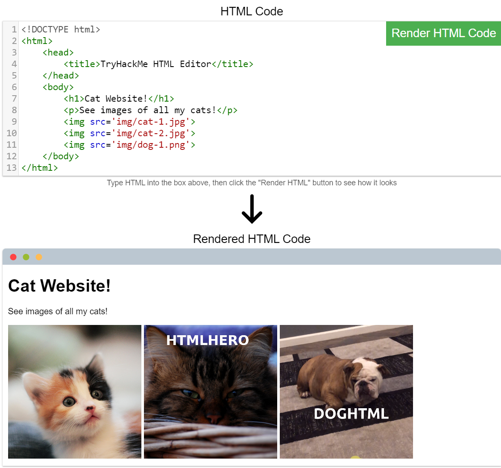

**Task 1**

There are two major components that make up a website:

1. Front End (Client-Side) - the way your browser renders a website.
2. Back End (Server-Side) - a server that processes your request and returns a response.

There are many other processes involved in your browser making a request to a web server, but for now, you just need to understand that you make a request to a server, and it responds with data your browser uses to render information to you.

What term best describes the component of a web application rendered by your browser?

```
Front End
```

**Task 2**

The HTML structure (as shown in the screenshot) has the following components:

- The `<!DOCTYPE html>` defines that the page is a HTML5 document. This helps with standardisation across different browsers and tells the browser to use HTML5 to interpret the page.
- The `<html>` element is the root element of the HTML page - all other elements come after this element.
- The `<head>` element contains information about the page (such as the page title)
- The `<body>` element defines the HTML document's body; only content inside of the body is shown in the browser.
- The `<h1>` element defines a large heading
- The `<p>` element defines a paragraph
- There are many other elements (tags) used for different purposes. For example, there are tags for buttons (`<button>`), images (``), lists, and much more.

Questions:

One of the images on the cat website is broken - fix it, and the image will reveal the hidden text answer!

basically missing a jpg, can just add .jpg to cat-2

Answers:

```
HTMLHERO
```

Add a dog image to the page by adding another img tag () on line 11. The dog image location is img/dog-1.png. What is the text in the dog image?



I mean just copy and paste the img src, nothing rocket science.

Answers:

```
DOGHTML
```

**Task 2**