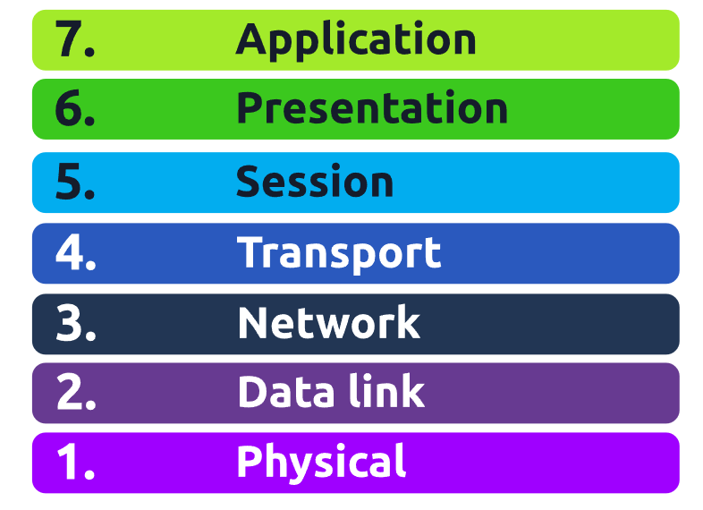

**Task 1**
The **OSI** model (or **O**pen **S**ystems **I**nterconnection Model) is an absolute fundamental model used in networking.  This critical model provides a framework dictating how all networked devices will send, receive and interpret data.

Answers:
What does the "OSI" in "OSI Model" stand for?
```
Open Systems Interconnection
```
How many layers (in digits) does the OSI model have?
```
7
```
What is the key term for when pieces of information get added to data?
```
encapsulation
```

**Task 2**

LAYER 7 - APPLICATION
The application layer of the OSI model is the layer that you will be most familiar with. This familiarity is because the application layer is the layer in which protocols and rules are in place to determine how the user should interact with data sent or received.

Everyday applications such as email clients, browsers, or file server browsing software such as FileZilla provide a friendly, **G**raphical **U**ser **I**nterface (**GUI**) for users to interact with data sent or received. Other protocols include **DNS** (**D**omain **N**ame **S**ystem), which is how website addresses are translated into IP addresses.

Answers:
What is the name of this Layer?
```
Application
```
What is the technical term that is given to the name of the software that users interact with?
```
Graphical User Interface
```

**Task 3**

LAYER 6 - PRESENTATION
Layer 6 of the OSI model is the layer in which standardisation starts to take place. Because software developers can develop any software such as an email client differently, the data still needs to be handled in the same way — no matter how the software works.

This layer acts as a translator for data to and from the application layer (layer 7). The receiving computer will also understand data sent to a computer in one format destined for in another format. For example, when you send an email, the other user may have another email client to you, but the contents of the email will still need to display the same.

Security features such as data encryption (like HTTPS when visiting a secure site) occur at this layer.

Answers:
What is the name of this Layer?
```
Presentation
```
What is the main purpose that this Layer acts as?
```
Translator
```

**Task 4**

LAYER 5 - SESSION
Once data has been correctly translated or formatted from the presentation layer (layer 6), the session layer (layer 5) will begin to create a connection to the other computer that the data is destined for. When a connection is established, a session is created. Whilst this connection is active, so is the session.

The session layer (layer 5) synchronises the two computers to ensure that they are on the same page before data is sent and received. Once these checks are in place, the session layer will begin to divide up the data sent into smaller chunks of data and begin to send these chunks (packets) one at a time. This dividing up is beneficial because if the connection is lost, only the chunks that weren't yet sent will have to be sent again — not the entire piece of the data (think of it as loading a save file in a video game).

What is worthy of noting is that sessions are unique — meaning that data cannot travel over different sessions, but in fact, only across each session instead.

Answers:
What is the name of this Layer?
```
Session
```
What is the technical term for when a connection is successfully established?
```
Session
```
What is the technical term for "small chunks of data"?
```
Packets
```

**Task 5**

LAYER 4 - TRANSPORT
Layer 4 of the OSI model plays a vital part in transmitting data across a network and can be a little bit difficult to grasp. When data is sent between devices, it follows one of two different protocols that are decided based upon several factors:

- TCP
- UDP

| **Advantages of TCP**                                                                    | **Disadvantages of TCP**                                                                                                                          |
| ---------------------------------------------------------------------------------------- | ------------------------------------------------------------------------------------------------------------------------------------------------- |
| Guarantees the accuracy of data.                                                         | Requires a reliable connection between the two devices. If one small chunk of data is not received, then the entire chunk of data cannot be used. |
| Capable of synchronising two devices to prevent each other from being flooded with data. | A slow connection can bottleneck another device as the connection will be reserved on the receiving computer the whole time.                      |
| Performs a lot more processes for reliability.                                           | TCP is significantly slower than UDP because more work has to be done by the devices using this protocol.\|                                       |

TCP is used for situations such as file sharing, internet browsing or sending an email. This usage is because these services require the data to be accurate and complete (no good having half a file!).

| **Advantages of UDP**                                                                                                 | **Disadvantages of UDP**                                                           |
| --------------------------------------------------------------------------------------------------------------------- | ---------------------------------------------------------------------------------- |
| UDP is much faster than TCP.                                                                                          | UDP doesn't care if the data is received.                                          |
| UDP leaves the application layer (user software) to decide if there is any control over how quickly packets are sent. | It is quite flexible to software developers in this sense.                         |
| UDP does not reserve a continuous connection on a device as TCP does.                                                 | This means that unstable connections result in a terrible experience for the user. |
UDP is useful in situations where there are small pieces of data being sent. For example, protocols used for discovering devices (_ARP_ and _DHCP_ ) or larger files such as video streaming (where it is okay if some part of the video is pixelated. 

Answers:
What is the name of this Layer?

What does TCP stand for?

What does UDP stand for?

What protocol guarantees the accuracy of data?

What protocol doesn't care if data is received or not by the other device?

What protocol would an application such as an email client use?

What protocol would an application that downloads files use?